  Hello! I'm Paulo. ✌️
   
  I'm a Mobile Developer specializing in native Android and iOS applications.
   
  I hold a Bachelor's degree in Information Systems and a Postgraduate degree in Mobile Engineering

  

 
<h3 align="center">Core Technologies</h3>

  

 
<h3 align="center">GitHub Stats</h3>

  
  

 

  
  
  
  
  
  

